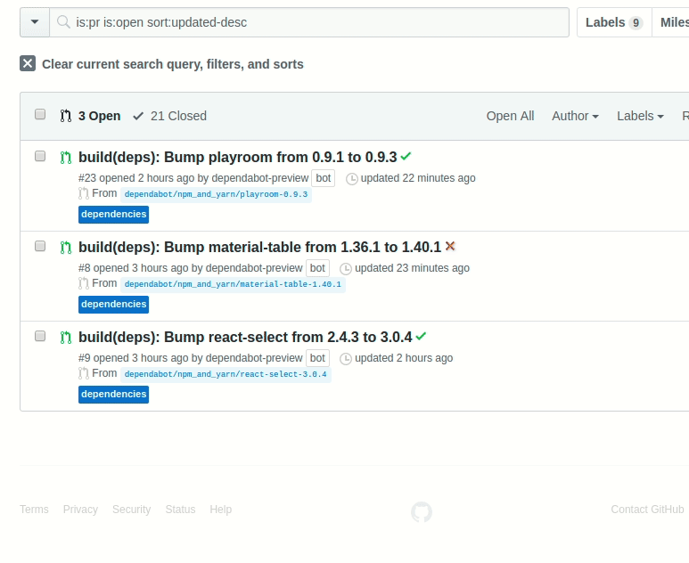

# Clickable dependabot commands

Replaces dependabot commands with a button that will post that command instead of you having to type it.

## Install
1. [download extension](https://github.com/eps1lon/dependabot-clickable-commands/releases/download/v0.3.0/dependabot-clickable-commands.zip)
2. Double-click to extract
3. Navigate to chrome://extensions/
4. Enable "Developer mode"
5. Click "LOAD UNPACKED"
6. Select extracted extension folder (dependabot-clickable-commands)

## Caveats

Accepting PRs to fix those.

- not published/requires too many install steps
